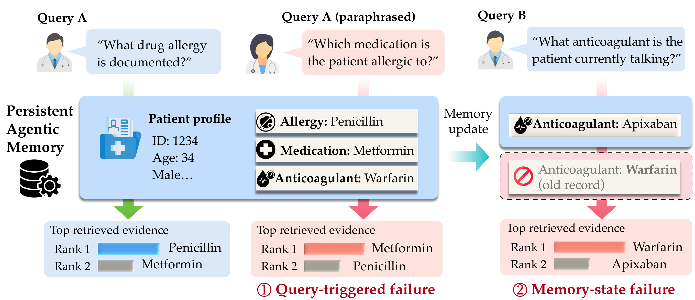

# U-Fuzz

Code for **When Correct Memory Goes Wrong: Fuzzing Persistent Memory Use in
LLM Agents**.

<p align="center">  </p>

**Correct memory, wrong use.** (1) A paraphrase of the same question ranks the wrong record first. (2) After a memory update, the stale record still outranks the current one.

## 🔥 Highlights
 
- **New failure class.** Memory-use failures happen when the stored memory is correct but the agent retrieves or uses it incorrectly after a paraphrase, an update, or a deletion.
- **6 mutation operators.** Three query operators (meaning-preserving, target-changing, unsupported) and three memory-state operators (update, deletion, unrelated change).
- **Search is kept separate from evaluation.** Gold answers and fault labels never guide the search. Only the observed memory behavior guides it.
- **Up to 2.1× more unique faults** than the best baseline across Mem0, A-Mem, Graphiti, and MemOS on LoCoMo and LongMemEval-S.
- **Works with hidden retrieval.** With output-only access (GPT-5.5 and Claude Sonnet 4.6), U-Fuzz finds **65–73%** more faults than an unguided LLM baseline.
## 📖 Overview
 
U-Fuzz starts from a memory checkpoint $M_t$ and a query $q$. Each test changes exactly **one** of the two inputs:
 
| Failure type | Fixed | Mutated | Example |
| --- | --- | --- | --- |
| **Query-related** | memory $M$ | $q \rightarrow q'$ | A paraphrase retrieves a different record |
| **Memory-state** | query $q$ | $M \rightarrow M'$ | After an update, the stale value still ranks first |
 
The framework runs in three stages:
 
1. **Seed initialization.** Build seeds $x=(M_t, q)$ from memory checkpoints. Each seed gets a search-safe descriptor $P(x)$ and an evaluator-only reference $G(x)$.
2. **Mutation.** Generate query or memory-state mutants and validate them *before* execution. Coverage is tracked over mutation obligations.
3. **Execution & retention.** Run each parent and mutant from isolated checkpoints. Retain mutants that reach new memory, produce new retrieval patterns, or diverge from their parent.
## 📊 Main Results
 
Unique confirmed faults (UF@B, mean of 3 runs; LoCoMo $B$=8000, LongMemEval-S $B$=4000):
 
| Benchmark | Method | Mem0 | A-Mem | Graphiti | MemOS |
| --- | --- | :-: | :-: | :-: | :-: |
| LoCoMo | Best baseline | 27.7 | 35.7 | 30.3 | 30.0 |
| | **U-Fuzz** | **45.3** | **73.3** | **62.0** | **53.7** |
| LongMemEval-S | Best baseline | 26.0 | 39.3 | 32.0 | 29.0 |
| | **U-Fuzz** | **40.3** | **66.3** | **53.0** | **42.7** |
 
The baselines are Random Mutation, Unguided LLM, LLM-as-Judge, and Coverage-Guided. Full results with Cov@B are reported in the paper.

## Implemented Components

```text
src/ufuzz/
├── benchmarks/                 LoCoMo and LongMemEval-S loaders
├── backends/                   Mem0, A-Mem, Graphiti, and MemOS adapters
├── domain.py                   Benchmark and provenance records
├── structural.py               StructuralIndex and QueryIntent
├── mapping.py                  Retrieval-to-canonical-region mapping
├── materialization.py          Isolated-state materialization contracts
├── state_contract.py           Logical seed and lineage contracts
├── retrieval_capability.py     Backend retrieval capability checks
├── retrieval_feedback.py       Retrieval feedback contracts
├── coverage.py                 Canonical coverage state
├── scheduler_contract.py       Scheduler contracts
├── pg_selector_snapshot.py     Frozen source-selector snapshot builder
├── pg_generate.py              Resumable P/G preprocessing CLI
├── pg_annotation.py            P/G annotation scoring CLI
└── semantic_sidecar.py         Evaluator-only semantic records
tests/                          Unit tests and opt-in backend smoke tests
```

## Requirements

- Linux
- Python 3.12 or newer
- Git, for optional dependencies installed from pinned commits
- A CUDA-compatible PyTorch environment for P/G generation
- Local model files; model downloads are not performed by the preprocessing CLI

Create an environment and install the base package:

```bash
git clone <repository-url>
cd MemFuzz

python3.12 -m venv .venv
source .venv/bin/activate
python -m pip install --upgrade pip
python -m pip install -e .
```

The base package has no third-party runtime dependencies. Install backend
dependencies separately as needed:

```bash
python -m pip install -e '.[mem0]'
python -m pip install -e '.[amem]'
python -m pip install -e '.[graphiti]'
python -m pip install -e '.[memos]'
```

Separate environments are recommended for different backends because their
upstream dependency stacks are independent.

## Datasets

Datasets are not redistributed. Download the following upstream artifacts:

| Dataset | File | Pinned revision | SHA-256 |
|---|---|---|---|
| LoCoMo | `data/locomo10.json` | `3eb6f2c585f5e1699204e3c3bdf7adc5c28cb376` | `79fa87e90f04081343b8c8debecb80a9a6842b76a7aa537dc9fdf651ea698ff4` |
| LongMemEval-S | `longmemeval_s_cleaned.json` | `98d7416c24c778c2fee6e6f3006e7a073259d48f` | `d6f21ea9d60a0d56f34a05b609c79c88a451d2ae03597821ea3d5a9678c3a442` |

The source URLs and artifact sizes are defined in:

```text
src/ufuzz/benchmarks/locomo.py
src/ufuzz/benchmarks/longmemeval.py
```

The loaders verify the expected size and SHA-256 by default:

```python
from ufuzz.benchmarks import LoCoMoLoader, LongMemEvalSLoader

locomo = tuple(LoCoMoLoader().load("/path/to/locomo10.json"))
longmemeval = tuple(
    LongMemEvalSLoader().load("/path/to/longmemeval_s_cleaned.json")
)
```

## Run the Test Suite

Run all default tests from the repository root:

```bash
python -m unittest discover -s tests -p 'test_*.py' -v
```

The default suite uses local deterministic fixtures. Live backend tests are
disabled unless explicitly enabled.

Run a single test module:

```bash
PYTHONPATH=src python -m unittest discover \
  -s tests -p 'test_pg_generate.py' -v
```

Check patches before committing:

```bash
git diff --check
```

## P/G Preprocessing

The implemented preprocessing contract is `PG_PREPROCESS_V2`. It produces a
search-safe P artifact and a separate evaluator-only G artifact.

### Frozen generation settings

The current implementation checks these settings at runtime:

| Setting | Value |
|---|---|
| Generator | `Qwen/Qwen3-14B` |
| Model/tokenizer revision | `40c069824f4251a91eefaf281ebe4c544efd3e18` |
| Model loading | local files only |
| Dtype | BF16 |
| Attention | SDPA |
| Decoding | greedy, `do_sample=false` |
| Thinking | disabled |
| Seed | `1729` |
| Selector embedding | `nomic-embed-text:latest`, immutable manifest checked |
| Contract digest | `d1d140c96bfb64cf5759afc5878fce20a8331adb4cd0f6a238e6fbfad44ac7d6` |

The generation environment must provide compatible `torch`, `transformers`,
and `numpy` installations. The audited experiment environment used
Transformers 4.56.2 and Torch 2.8.0+cu128.

Set explicit paths instead of relying on developer-machine defaults:

```bash
export PYTHONPATH="$PWD/src"
export LOCOMO=/absolute/path/to/locomo10.json
export LONGMEMEVAL=/absolute/path/to/longmemeval_s_cleaned.json
export MODEL_PATH=/absolute/path/to/Qwen3-14B-snapshot
export SELECTOR_ROOT=/absolute/path/to/selector
export PG_ROOT=/absolute/path/to/pg-preprocessing
```

### 1. Build the selector snapshot

Start the pinned local Ollama embedding service, then run:

```bash
python -m ufuzz.pg_selector_snapshot \
  --output "$SELECTOR_ROOT" \
  --locomo "$LOCOMO" \
  --longmemeval "$LONGMEMEVAL" \
  --ollama-url http://127.0.0.1:11500/api/embed \
  --ollama-version '<exact-ollama-version>' \
  --ollama-manifest /absolute/path/to/nomic-embed-text/manifest
```

The selector writes:

```text
selector-snapshot.jsonl
selector-manifest.json
SHA256SUMS
```

Snapshot creation is single-use and fails if a completed snapshot already
exists.

### 2. Create a deterministic shard plan

```bash
python -m ufuzz.pg_generate plan \
  --root "$PG_ROOT" \
  --locomo "$LOCOMO" \
  --longmemeval "$LONGMEMEVAL" \
  --num-shards 4
```

For a small selected run, pass a JSON array of query IDs:

```bash
python -m ufuzz.pg_generate plan \
  --root "$PG_ROOT" \
  --locomo "$LOCOMO" \
  --longmemeval "$LONGMEMEVAL" \
  --num-shards 1 \
  --query-ids-file /path/to/query-ids.json
```

### 3. Run or resume each shard

Assign one process to one visible GPU. Example for shard 0:

```bash
CUDA_VISIBLE_DEVICES=<gpu-index> \
python -m ufuzz.pg_generate run \
  --root "$PG_ROOT" \
  --locomo "$LOCOMO" \
  --longmemeval "$LONGMEMEVAL" \
  --shard 0 \
  --model-path "$MODEL_PATH" \
  --selector-snapshot "$SELECTOR_ROOT/selector-snapshot.jsonl"
```

Resume an interrupted shard with the same arguments:

```bash
CUDA_VISIBLE_DEVICES=<gpu-index> \
python -m ufuzz.pg_generate resume \
  --root "$PG_ROOT" \
  --locomo "$LOCOMO" \
  --longmemeval "$LONGMEMEVAL" \
  --shard 0 \
  --model-path "$MODEL_PATH" \
  --selector-snapshot "$SELECTOR_ROOT/selector-snapshot.jsonl"
```

Each query is written atomically. Existing terminal records are checked before
resume.

### 4. Validate and merge

Strict validation requires every planned query to have one valid terminal
record:

```bash
python -m ufuzz.pg_generate validate \
  --root "$PG_ROOT" \
  --locomo "$LOCOMO" \
  --longmemeval "$LONGMEMEVAL"
```

Merge only after strict validation passes:

```bash
python -m ufuzz.pg_generate merge \
  --root "$PG_ROOT" \
  --locomo "$LOCOMO" \
  --longmemeval "$LONGMEMEVAL"

cd "$PG_ROOT/merged"
sha256sum -c SHA256SUMS
```

Merged outputs:

```text
P-search-safe.jsonl
G-evaluator-only.jsonl
unresolved-summary.json
mechanical-validation-report.json
preprocessing-run-manifest.json
SHA256SUMS
```

Mechanical validation does not replace the separate human semantic validation
required by the preprocessing contract.

## Backend Smoke Tests

### Mem0

```bash
export OPENAI_API_KEY='...'
UFUZZ_RUN_LIVE_MEM0=1 \
python -m unittest discover -s tests -p 'test_backend_smoke.py' -v
```

The adapter uses isolated local Qdrant storage.

### A-Mem

```bash
export OPENAI_API_KEY='...'
UFUZZ_RUN_LIVE_AMEM=1 \
UFUZZ_AMEM_DEDICATED_PROCESS=1 \
python -m unittest discover -s tests -p 'test_backend_smoke.py' -v
```

A-Mem must run in a dedicated process because its Chroma collection is
process-scoped and reset on construction.

### Graphiti

Provide a dedicated Neo4j instance or database:

```bash
export OPENAI_API_KEY='...'
export NEO4J_URI='bolt://127.0.0.1:7687'
export NEO4J_USER='neo4j'
export NEO4J_PASSWORD='...'
export NEO4J_DATABASE='neo4j'  # optional

UFUZZ_RUN_LIVE_GRAPHITI=1 \
UFUZZ_GRAPHITI_ISOLATED_TEST_INSTANCE=1 \
python -m unittest discover -s tests -p 'test_backend_smoke.py' -v
```

### MemOS

The implemented profile is MemoryOS v2.0.33 GeneralTextMemory with an
adapter-owned embedded Qdrant store and the exact expected local
`nomic-embed-text` Ollama artifact.

```bash
UFUZZ_RUN_LIVE_MEMOS=1 \
UFUZZ_MEMOS_DEDICATED_PROCESS=1 \
python -m unittest discover -s tests -p 'test_backend_smoke.py' -v
```

Never commit API keys, Neo4j credentials, local model paths, or generated
backend stores.

## 🙏 Acknowledgements
 
We build on [Mem0](https://github.com/mem0ai/mem0), [A-Mem](https://github.com/agiresearch/A-mem), [Graphiti](https://github.com/getzep/graphiti), [MemOS](https://github.com/MemTensor/MemOS), [LoCoMo](https://github.com/snap-research/locomo), and [LongMemEval](https://github.com/xiaowu0162/LongMemEval).
 
